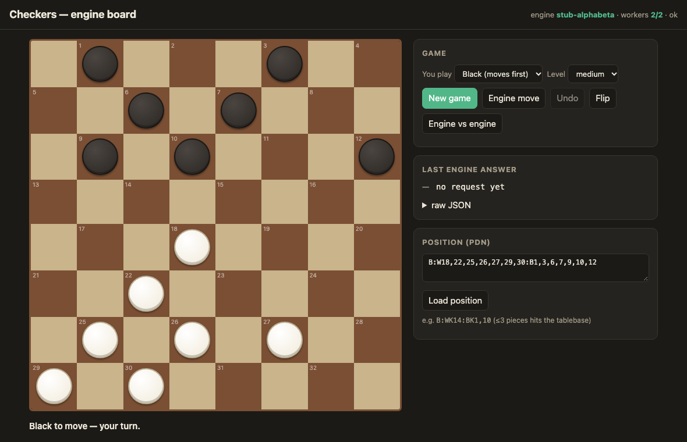
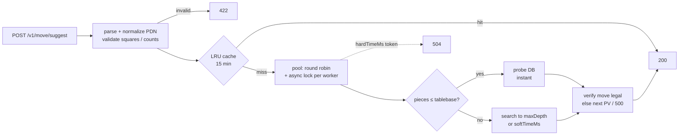

<div align="center">

# ♛ Checkers Move API

**REST API that takes a checkers position in PDN and returns the best move.**<br>
ASP.NET Core 8 · built for IIS · has a Chinook adapter · runs out of the box on its own engine

[](https://github.com/bogdan734/checkers-api/actions/workflows/ci.yml)


**[▶ Live demo](https://918a940c681269.lhr.life)** · [API](#api) · [Run it](#run-it) · [Chinook on Windows + IIS](#real-chinook-on-windows--iis)



</div>

> **Engine note.** Chinook and KingsRow, along with their 2–8 piece endgame databases, are proprietary Windows
> binaries with no public download. This repo includes a working Chinook adapter (a pool of long-lived worker
> processes) and its own engine (alpha-beta search plus a 3-piece endgame tablebase) so the service works end to end
> without them. You switch between them with a single setting: `Engine:Type`.

---

## Contents

- [What's inside](#whats-inside)
- [API](#api)
- [Request flow](#request-flow)
- [Configuration](#configuration)
- [Run it](#run-it)
- [Real Chinook on Windows + IIS](#real-chinook-on-windows--iis)
- [Tests and acceptance criteria](#tests-and-acceptance-criteria)
- [Project layout](#project-layout)

## What's inside

| | |
|---|---|
| **3 endpoints** | `POST /v1/move/suggest`, `POST /v1/move/validate`, `GET /healthz` (plus `/v1/position/moves` for the UI) |
| **Engine adapters** | `IEngineAdapter` with `SetPositionAsync(pdn)` / `SearchAsync(limits)` → `{ bestMove, pv, scoreOrWDL, nodes, depth, tablebaseHit }` |
| **`ChinookEngineAdapter`** | Drives an external engine process over a line protocol. Kills and respawns a worker after a hard timeout |
| **`StubEngineAdapter`** | Built-in engine: iterative-deepening alpha-beta with a transposition table, capture extensions and killer/history move ordering, plus an exact 3-piece WDL/DTW tablebase built at startup |
| **Worker pool** | 2 long-lived workers warmed at startup. Requests go round robin, with an async lock per worker. Processes are never spawned per request |
| **Time control** | `softTimeMs` is enforced inside the engine. `hardTimeMs` is a `CancellationToken` set in the controller and returns **504** when it expires |
| **Cache** | LRU, 20 000 entries, 15-minute TTL. Key is canonical PDN + level + limits |
| **Logging** | One JSON line per request: `requestId, timeMs, depth, nodes, tablebaseHit, …` |
| **Web board** | `wwwroot/index.html`: play against the engine, watch engine vs engine, load any PDN, inspect the raw JSON |

## API

### `POST /v1/move/suggest`

```bash
curl -s https://918a940c681269.lhr.life/v1/move/suggest -H 'content-type: application/json' -d '{
  "gameId": "g1",
  "state":  { "notation": "PDN", "position": "B:W18,22,25,26,27,29,30:B1,3,6,7,9,10,12" },
  "level":  "strong",
  "limits": { "maxDepth": 16, "softTimeMs": 550, "hardTimeMs": 1200 }
}'
```

```json
{
  "engine": "stub-alphabeta",
  "bestMove": "10-14",
  "pv": ["10-14", "27-24", "14x23", "26x19", "7-11"],
  "scoreOrWDL": 9,
  "depth": 12,
  "nodes": 3113675,
  "positionKey": "db5ace72a600f036",
  "info": { "tablebaseHit": false, "timeMs": 551, "cached": false }
}
```

- **`scoreOrWDL`** is a number (centipawns, from the side to move) for a search result, or `"WIN"` / `"DRAW"` / `"LOSS"` for a tablebase hit.
- **Moves** list landing squares: `11-15`, `22x15`, `9x18x27`.
- **Positions** can be given as `B:W21,22,K30:B1-12`, as `[FEN "…"]`, or as `start`. Kings take a `K` prefix, and ranges are allowed.

| level | depth | soft time | randomness |
|---|---|---|---|
| `weak` | 7 | 100 ms | none |
| `medium` | 11 | 250 ms | none |
| `strong` | 16 | 550 ms | none; probes the tablebase first |
| *(omitted)* | 14 | `Limits:DefaultSoftTimeMs` | none |

Any field you set in `limits` overrides the level's value.

### `POST /v1/move/validate`

```json
{ "position": "start", "move": "11-15" }        →   { "legal": true }
```

### `GET /healthz`

```json
{ "ok": true, "workers": 2, "configured": 2, "engine": "stub-alphabeta" }
```
Returns **503** with `ok: false` until every worker is warm, for example when the engine binary is missing.

### Errors

All errors share one shape: `{ "code": "...", "message": "...", "requestId": "..." }`.

| status | when |
|---|---|
| **422** | invalid PDN or square, bad piece count, man on the promotion row, unknown level, bad limits, no legal moves |
| **504** | `hardTimeMs` expired |
| **500** | the engine returned a move that is illegal in the root position, and no PV entry was legal either |

## Request flow



## Configuration

`appsettings.json` uses the production values from the spec:

```json
{
  "Engine": { "Type": "chinook", "Path": "C:\\engines\\chinook\\chinook.exe", "Workers": 2, "Databases": "D:\\tb\\chinook" },
  "Cache":  { "Capacity": 20000, "TtlMinutes": 15 },
  "Limits": { "DefaultSoftTimeMs": 300, "DefaultHardTimeMs": 1200 }
}
```

| key | meaning |
|---|---|
| `Engine:Type` | `chinook` (external process pool) or `stub` (built-in engine). Development and Docker use `stub` |
| `Engine:Args` | extra arguments for the engine executable. `--db "<Databases>"` is appended automatically |
| `Engine:TablebasePieces` | size of the stub tablebase: 3 by default, 4 works but is slow and memory-hungry |
| `Engine:StartupTimeoutMs` | how long to wait for `readyok` during warm-up |

Any key can also be set from an environment variable, e.g. `Engine__Type=stub`.

## Run it

**.NET SDK**
```bash
dotnet run --project src/CheckersApi          # Development profile → stub engine; open / for the board
```

**Docker**
```bash
docker build -t checkers-api .
docker run -p 8080:8080 checkers-api          # http://localhost:8080 ; honours $PORT
```

**One-click cloud (Render, free tier)**

[](https://render.com/deploy?repo=https://github.com/bogdan734/checkers-api)

`render.yaml` is included. The same image also runs on Railway, Fly.io and Azure Container Apps.

## Real Chinook on Windows + IIS

1. Install the **.NET 8 Hosting Bundle** and restart IIS.
2. Publish the app:
   ```powershell
   dotnet publish src/CheckersApi -c Release -o C:\inetpub\checkers-api
   ```
3. Place the engine at `C:\engines\chinook\chinook.exe` and the databases at `D:\tb\chinook`.
4. Chinook has no command-line interface of its own, so `Engine:Path` must point to an executable that speaks this
   protocol. A thin shim around the CheckerBoard engine DLL (`getmove`) or around KingsRow is enough:

   ```text
   isready                                  -> readyok
   position <canonical pdn>
   go depth <d> time <ms> tb <0|1>          -> info depth <d> nodes <n> score cp <x>|wdl <WIN|DRAW|LOSS> tb <0|1> pv <m1> <m2> ...
                                               bestmove <move>          (or: bestmove none)
   quit
   ```

   [`src/CheckersApi.EngineCli/Program.cs`](src/CheckersApi.EngineCli/Program.cs) is an 80-line reference
   implementation of this protocol, and the integration tests run the adapter against it.
5. Configure the IIS site:
   - App pool: **No Managed Code**, **Start Mode = AlwaysRunning**, **Idle Time-out = 0**.
   - Site: **Preload Enabled = true**, with the *Application Initialization* feature installed.

   `web.config` (in-process hosting, stdout log) is already included.
6. Open `GET /healthz` and check that `ok` is `true` and `workers` is `2`.

No Windows Service is involved. The engine workers run as child processes of `w3wp.exe`.

## Tests and acceptance criteria

```bash
dotnet test        # 50 tests. The app targets net8.0; the test host needs the .NET 9 SDK
```

| acceptance criterion | test |
|---|---|
| `healthz` ok on startup | `Healthz_is_ok_on_startup_with_two_workers` |
| tablebase position returns in < 50 ms with `tablebaseHit: true` | `Tablebase_position_returns_fast_with_tablebaseHit` |
| strong midgame returns a legal move in < 600 ms | `Midgame_strong_returns_legal_move_under_600ms` |
| invalid PDN → 422 | `Invalid_pdn_returns_422` |
| timeout → 504 | `Hard_timeout_returns_504`, `Hard_timeout_kills_worker_and_pool_recovers` |

Other tests cover:

- move generation, checked against the known perft counts for English draughts up to depth 6
- multi-jumps and crowning
- PDN parsing
- tablebase correctness
- round robin and the per-worker lock
- LRU eviction and TTL expiry
- JSON log fields
- the Chinook process adapter running against the reference CLI, including a missing binary making `/healthz` return 503

## Project layout

```text
src/
  Checkers.Core/            rules, move generation, PDN, search, endgame tablebase
  CheckersApi/              controllers, MoveService, EnginePool, adapters, LRU cache, JSON logging, wwwroot board
  CheckersApi.EngineCli/    reference engine process (line protocol) = template for a Chinook shim
tests/CheckersApi.Tests/    unit + integration + acceptance tests
Dockerfile · render.yaml · .github/workflows/ci.yml
```
